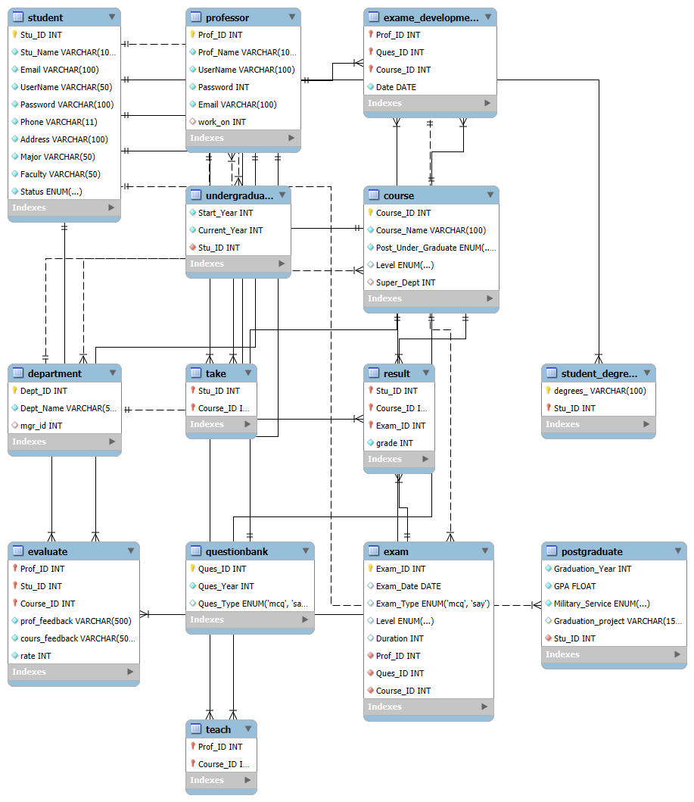

# University Database Project
This is a MySQL database project for managing university data, including students, professors, courses, and evaluations.

## Features (14) Table :
- Tables for students, professors, courses, departments, exams,.... etc.
- Queries to retrieve data such as:
  - Student results per course.
  - Top 10 high scores per course.
  - Highest evaluation professor.

## For more Info :
- read the analysis pdf of the case study 
[result.pdf](result.pdf)

## How to Use:
1. Import the `university.sql` file into your MySQL server.
2. Run the provided queries to interact with the database.

## Author:

Abdallah Ali Abdallah
www.linkedin.com/in/abdallah-ali98

